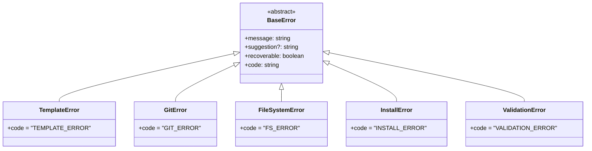
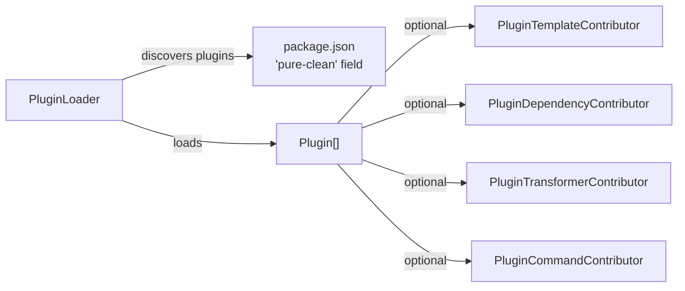
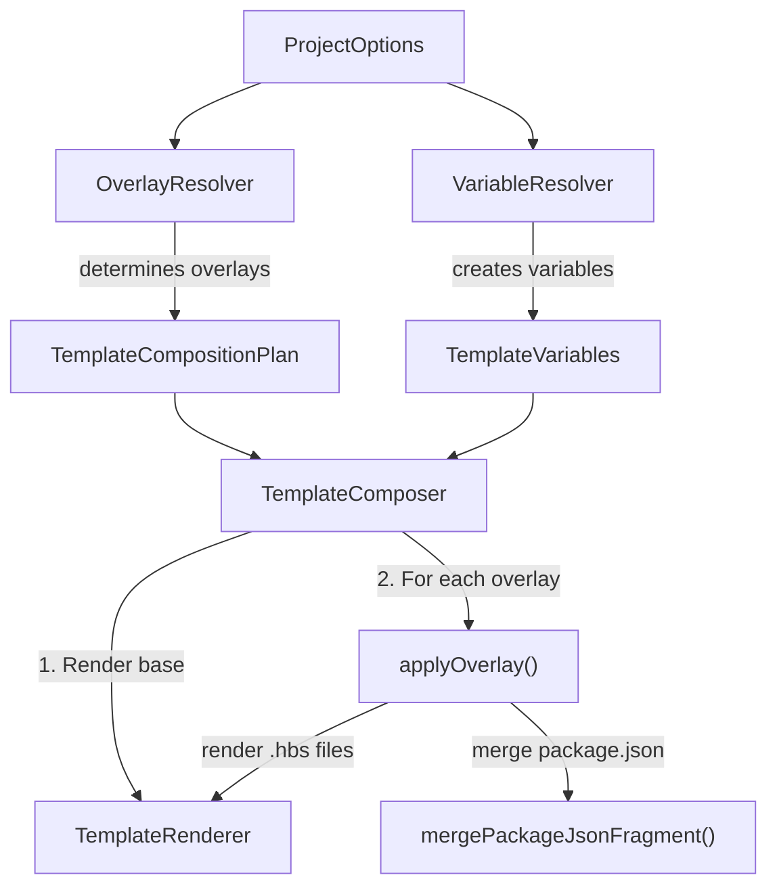

# Architecture

This CLI is built following Clean Architecture principles with clear separation of concerns across four layers.

## Layer Structure

```
src/
├── domain/              # Core business logic & entities (innermost)
├── application/         # Use cases & orchestration
├── infrastructure/      # External implementations & services
├── shared/              # Cross-cutting concerns (errors, utils)
├── presentation/        # CLI entry points & commands (outermost)
├── composition/         # Dependency injection wiring
└── main.ts              # Application entry point
```

## Dependency Rule

Dependencies point inward only. Outer layers depend on inner layers, never the reverse:

```
┌─────────────────────────────────────────────────┐
│                 PRESENTATION                     │
│           (CLI commands, main.ts)                │
├─────────────────────────────────────────────────┤
│               COMPOSITION                        │
│         (DI container, wiring)                   │
├─────────────────────────────────────────────────┤
│               APPLICATION                        │
│       (Use cases, handlers, prompts)             │
├─────────────────────────────────────────────────┤
│               INFRASTRUCTURE                    │
│   (File system, Git, Templates, Plugins,         │
│    Package managers, health, Update)             │
├─────────────────────────────────────────────────┤
│                 SHARED                           │
│        (Errors, Transformers, Utils)             │
├─────────────────────────────────────────────────┤
│                  DOMAIN                          │
│   (Interfaces, Types, Business Rules)            │
│         (innermost - no external deps)           │
└─────────────────────────────────────────────────┘
```

## Dependency Flow (Mermaid)

```mermaid
graph TD
    subgraph Presentation
        Main["main.ts"]
        InitCmd["init.command"]
        GenCmd["generate.command"]
        UpdateCmd["update.command"]
        healthCmd["health.command"]
    end

    subgraph Composition
        Composer["init.composer.ts<br/>(DI Container)"]
    end

    subgraph Application
        InitHandler["InitHandler"]
        TemplateGen["TemplateGenerator"]
        CodeGens["Code Generators<br/>(feature/entity/repo/service/usecase)"]
        Prompts["User Prompts"]
    end

    subgraph Infrastructure
        FileSys["FileSystemService"]
        Terminal["TerminalService"]
        GitSvc["GitService"]
        GitWrapper["GitServiceWrapper"]
        TemplateRes["TemplateResolver"]
        TemplateRdr["TemplateRenderer"]
        TemplateComp["TemplateComposer"]
        OverlayRes["OverlayResolver"]
        VarRes["VariableResolver"]
        InstallerFactory["InstallerFactory"]
        InstallerSvc["InstallerService"]
        Plugins["Plugin System"]
        healthSvc["healthService"]
        UpdateSvc["UpdateService"]
    end

    subgraph Shared
        Errors["Error Hierarchy"]
        ErrHandler["handleError()"]
        Transformers["DependencyTransformer<br/>PackageJsonTransformer"]
        Naming["naming.ts"]
    end

    subgraph Domain
        Interfaces["Service Interfaces"]
        ProjectOpts["ProjectOptions"]
        TemplateTypes["TemplateDefinition"]
        DepTypes["DependencySet"]
        DepResolver["DependencyResolver"]
        Packages["packages.ts"]
    end

    Main --> Composer
    Main --> ErrHandler
    Main --> Plugins

    InitCmd --> Composer
    InitCmd --> ErrHandler
    GenCmd --> CodeGens
    GenCmd --> FileSys
    UpdateCmd --> UpdateSvc
    UpdateCmd --> ErrHandler
    healthCmd --> healthSvc
    healthCmd --> ErrHandler

    Composer --> InitHandler
    Composer --> FileSys
    Composer --> Terminal
    Composer --> TemplateRes
    Composer --> TemplateRdr
    Composer --> TemplateComp
    Composer --> DepResolver
    Composer --> InstallerFactory

    InitHandler --> TemplateGen
    InitHandler --> DepResolver
    InitHandler --> Transformers
    InitHandler --> InstallerSvc
    InitHandler --> GitWrapper
    InitHandler --> Prompts

    TemplateGen --> TemplateComp
    TemplateGen --> VarRes
    TemplateComp --> TemplateRdr
    TemplateComp --> OverlayRes
    TemplateComp --> FileSys

    InstallerSvc --> Terminal
    GitWrapper --> GitSvc
    GitWrapper --> Terminal

    CodeGens --> Naming

    InitHandler -.->|uses interfaces| Interfaces
    Composer -.->|implements| Interfaces
    Infrastructure -.->|implements| Interfaces
    Shared -.->|implements| Interfaces
    Domain -.->|defines| Interfaces
```



## UML Class Diagram - Service Interfaces

```mermaid
classDiagram
    class IFileSystemService {
        <<interface>>
        +ensureDirectory(path) Promise~void~
        +copy(source, dest) Promise~void~
        +readJson(path) Promise~Record~
        +writeJson(path, data) Promise~void~
        +readFile(path) Promise~string~
        +writeFile(path, content) Promise~void~
        +pathExists(path) Promise~boolean~
        +remove(path) Promise~void~
        +walk(dir) Promise~string[]~
    }

    class ITerminalService {
        <<interface>>
        +start(message) void
        +update(message) void
        +succeed(message?) void
        +fail(message?) void
        +stop() void
        +success(message) void
        +warning(message) void
        +error(message) void
        +info(message) void
        +step(current, total, message) void
        +blank() void
    }

    class IGitService {
        <<interface>>
        +isAvailable() Promise~boolean~
        +init(path) Promise~void~
        +addAll(path) Promise~void~
        +commit(path, msg) Promise~void~
        +isRepository(path) Promise~boolean~
    }

    class IPackageInstaller {
        <<interface>>
        +install(projectPath) Promise~void~
    }

    class IInstallerFactory {
        <<interface>>
        +create(manager) IPackageInstaller
    }

    class ITemplateResolver {
        <<interface>>
        +resolve(options) TemplateDefinition
    }

    class ITemplateRenderer {
        <<interface>>
        +render(templateDir, destDir, variables) Promise~void~
    }

    class IDependencyResolver {
        <<interface>>
        +resolve(options) DependencySet
    }

    class ITemplateTransformer {
        <<interface>>
        +transform(projectPath, options) Promise~void~
    }

    class ITemplateGenerator {
        <<interface>>
        +generate(context) Promise~void~
    }

    class TemplateRenderer {
        -deps: TemplateRendererDeps
        +render(templateDir, destDir, variables) Promise~void~
        -registerHelpers() void
        -renderFile(source, target, variables) Promise~void~
    }

    class GitService {
        +isAvailable() Promise~boolean~
        +init(path) Promise~void~
        +addAll(path) Promise~void~
        +commit(path, msg) Promise~void~
        +isRepository(path) Promise~boolean~
    }

    class InstallerFactory {
        +create(manager) IPackageInstaller
    }

    class TerminalService {
        +start(message) void
        +succeed(message?) void
        +fail(message?) void
        +warning(message) void
        +info(message) void
    }

    class FileSystemService {
        +ensureDirectory(path) Promise~void~
        +copy(source, dest) Promise~void~
        +readJson(path) Promise~Record~
        +writeJson(path, data) Promise~void~
        +walk(dir) Promise~string[]~
    }

    ITemplateRenderer <|.. TemplateRenderer
    IGitService <|.. GitService
    IInstallerFactory <|.. InstallerFactory
    ITerminalService <|.. TerminalService
    IFileSystemService <|.. FileSystemService
```



## Error Hierarchy



## Plugin System



## Template Composition Flow



## Key Design Decisions

1. **Constructor Injection**: All dependencies are injected via constructors, making testing straightforward
2. **Interface Segregation**: Each service has a minimal interface (ISP compliant)
3. **Composition Root**: Single `init.composer.ts` wires all dependencies for the init flow
4. **Graceful Degradation**: Git and dependency installation failures are non-fatal with user warnings
5. **Template Overlays**: Feature selection (state management, tools) composed as overlay fragments
6. **Plugin Architecture**: Extensible via `package.json` configuration, no code changes needed

---

## HttpClient Interface

The template provides two levels of HTTP abstraction in `_contracts/http/`:

### Low-level: `IHttp` (DomainService-driven)

Used when you have a domain service map mapping service names to base URLs:

```ts
interface IHttp<DomainServices> {
  request<ServiceName, TResponse>(
    params: RequestFor<DomainServices, ServiceName>,
    options?: Partial<HttpOptions>,
  ): Promise<TResponse>;
}
```

### High-level: `HttpClient` (convenience methods)

Used for direct URL-based calls with `get`, `post`, `put`, `patch`, `delete`:

```ts
interface HttpClient {
  get<T>(url: string, config?: RequestConfig): Promise<Result<T>>;
  post<T>(url: string, body?: unknown, config?: RequestConfig): Promise<Result<T>>;
  put<T>(url: string, body?: unknown, config?: RequestConfig): Promise<Result<T>>;
  patch<T>(url: string, body?: unknown, config?: RequestConfig): Promise<Result<T>>;
  delete<T>(url: string, config?: RequestConfig): Promise<Result<T>>;
}
```

Infrastructure provides concrete implementations:
- `FetchHttpClient` — built on the Fetch API
- `AxiosHttpClient` — built on Axios (optional)

---

## File Naming Conventions

Follow these conventions to keep the codebase navigable as it grows:

### Contracts

```
_contracts
 └── http
      ├── http.contract.ts        # HttpClient, IHttp, RequestConfig
      ├── storage.contract.ts     # IStorage
      └── cookie.contract.ts      # ICookie
```

Each contract file is named `{domain}.contract.ts`.

### Infrastructure — Builders

```
builders
 └── headers
      ├── headers.builder.ts      # implementation
      ├── headers.types.ts        # interface + internal types
      └── index.ts                # barrel export
```

Each file is named `{name}.builder.ts` and `{name}.types.ts` — never `index.builder.ts`.

### Infrastructure — Handlers

```
handlers
 └── error
      ├── error.handler.ts        # main class
      ├── error.mapper.ts         # error mapping logic
      ├── error.factory.ts        # error creation helpers
      ├── error.constants.ts      # error codes, severity, messages
      ├── error.types.ts          # interface + internal types
      └── index.ts                # barrel export
```

Each file is named `{name}.{role}.ts` — never `index.handler.ts`.

### Infrastructure — Services / Middlewares

```
services
 └── request-context
      ├── correlation-id.service.ts
      └── index.ts
```

Services that act as HTTP middleware/interceptors belong under `middlewares/` or `services/request-context/`.

---

## Dependency Direction Rules

Dependency direction must always follow Clean Architecture principles.

**Important:**

Infrastructure implementations must never depend on their own composition files.

### Bad

```
builders/response/response.builder.ts
        |
        v
http.dependencies.ts
```

Because:

- `http.dependencies.ts` is a composition root.
- It exists only to assemble dependencies.
- It must not become a source of contracts for implementations.

### Good

```
http.factory.ts
        |
        +----------------+
        |                |
        v                v
ResponseBuilder     HeadersBuilder
```

The factory creates the dependency graph.

---

## Dependency Files

`*.dependencies.ts` files are only responsible for dependency composition.

**They must contain:**

- dependency interfaces required by the main module
- dependency grouping types

**They must NOT contain:**

- builder contracts
- implementation contracts
- business rules
- shared types

### Example

```ts
// http.dependencies.ts
export interface HttpDependencies {
  headersBuilder: HeadersBuilder;
  responseBuilder: ResponseBuilder;
  urlBuilder: UrlBuilder;
  errorHandler: ErrorHandler;
}
```

---

## Internal Infrastructure Types

Internal infrastructure components should own their own types.

### Good

```
http
└── builders
    └── response
        ├── response.builder.ts
        └── response.types.ts
```

### Bad

```
http
├── http.dependencies.ts
└── builders
    └── index.builder.ts
```

where the builder imports types from `http.dependencies.ts`.

---

## Builder Rules

Builders are implementation details.

A builder should:

- expose its own public API
- contain its own internal types
- not know about factories
- not know about dependency containers
- not import dependency composition files

### Example

```ts
export default class ResponseBuilder {
  build<T>(payload: unknown): Result<T> {
    // ...
  }
}
```

---

## Interface Rules

Do not create interfaces for every class.

Create interfaces **only** when:

1. The type crosses an architectural boundary.
2. Multiple implementations are expected.
3. External consumers depend on the abstraction.

### Examples where interfaces are valuable

- `IHttp`
- `IStorage`
- `ICookie`

### Examples where interfaces are usually unnecessary

- `HeadersBuilder`
- `UrlBuilder`
- `ResponseBuilder`
- `CorrelationIdGenerator`

---

## Composition Root

Factories are the **only** place where concrete dependencies are connected.

```
http.factory.ts

HeadersBuilder
      |
ResponseBuilder
      |
UrlBuilder
      |
ErrorHandler
      |
      v
     Http
```

The main classes should receive ready dependencies and never create them internally.

---

## Rule of Thumb

If a file answers:

> "How do I create my dependency graph?"

It belongs to: **factory** or **dependencies**.

If a file answers:

> "How does this component work?"

It belongs to: **implementation module**.

**Never mix these responsibilities.**
